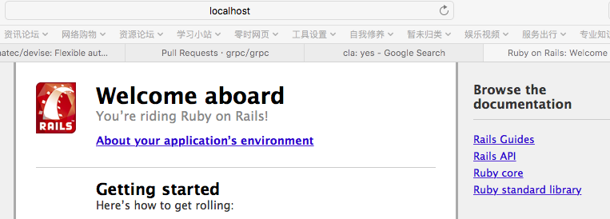
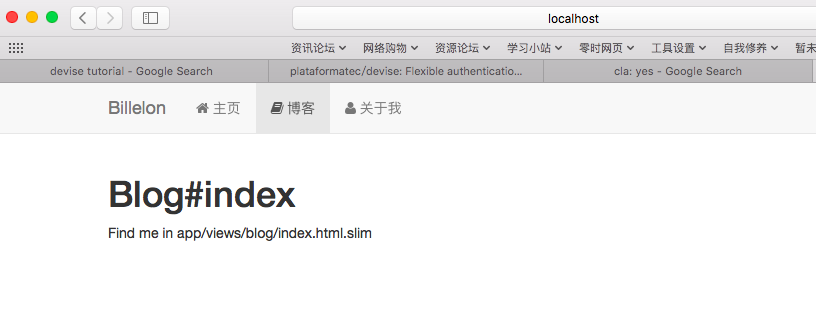

#Build My Site Step By Step 1

### 1. 开发环境


### 2. 创建新的Rails程序:

运行如下命令:

```bash
rails new website
```
如果下载速度慢更改ruby源地址(国内),修改文件`website/Gemfile`:

```ruby
#source 'https://rubygems.org'
source 'https://ruby.taobao.org/'
```
##### 更改渲染模版为slim：

在文件**Gemfile**添加入下：

```ruby
gem 'slim-rails', '~> 3.0.1'
gem 'html2slim'

```

运行如下命令安装相应库

```bash
bundle install
```


启动server服务:

```bash
bin/rails s
```
然后打开浏览器访问 `localhost:3000`:




### 3. 创建boostrap风格导航栏


创建`controller` 包括 home/blog/about，在命令行中执行：

```bash
bin/rails g controller home index
bin/rails g controller blog index 
bin/rails g controller about index
```

#### 添加网页主页路由
添加如下内容到**config/routes.rb:**

```ruby
# You can have the root of your site routed with "root"
root 'home#index'

get 'about' => 'about#index'

resources blog
```

#### 添加boostrap 和 fontawesome支持
在文件**Gemfile**添加入下,并运行`bundle install`：

```ruby

# bootstrap
gem 'bootstrap-sass'
gem 'autoprefixer-rails'

# fontawesome
gem 'font-awesome-rails'

```
更新(如果没有则新建)**assets/stylesheets/application.css.scss**:

```scss
 @import 'bootstrap-sprockets';
 @import 'bootstrap';
 @import 'font-awesome';
```
更新**assets/stylesheets/application.js**:

```javascript
= require jquery
= require bootstrap-sprockets
```

新增文件**views/layouts/_head.html.slim**：

```jade
head
  meta charset='utf-8'
  meta http-equiv='X-UA-Compatible' content='IE=edge'
  meta name='viewport' content='width=device-width, initial-scale=1'
  meta name='description' content='Billelon.io'
  = stylesheet_link_tag    "application", media: 'all', 'data-turbolinks-track' => true
  = javascript_include_tag "application", 'data-turbolinks-track' => true
  = csrf_meta_tags
  /!HTML5 shim and Respond.js for IE8 support of HTML5 elements and media queries
  /!WARNING: Respond.js doesn't work if you view the page via file://
  /[if lt IE 9]
    script src='https://oss.maxcdn.com/html5shiv/3.7.2/html5shiv.min.js'
    script src='https://oss.maxcdn.com/respond/1.4.2/respond.min.js' 
  title
```

修改文件**views/layouts/application.html.slim**：

```jade
doctype html
html
  = render 'layouts/head'
  body
    = yield
```

创建目录**views/shared**,并新增文件`_navigation_bar_html.slim`

```jade
nav class='navbar navbar-default navbar-static-top' role='banner'
  div class='container'
    div class='navbar-header'
      button type='button' class='navbar-toggle collapsed' data-toggle='collapse' data-target='#bs-navbar' aria-expanded='false' aria-controls='bs-navbar'
        span class='sr-only' Toggle navigation
        span class='icon-bar'
        span class='icon-bar'
        span class='icon-bar'
      a class='navbar-brand',href='#' Billelon
    div id='bs-navbar' class='collapse navbar-collapse'
      ul class='nav navbar-nav'
        li class=('active' if current_page?(root_path))
          = link_to root_path do
            i class='fa fa-home' &nbsp;主页
        / li class=('active' if current_page?(works_path))
        /   = link_to works_path do
        /     i class='fa fa-modx' &nbsp;作品
        li class=('active' if current_page?(blog_path))
          = link_to articles_path do
            i class='fa fa-book' &nbsp;博客
        li class=('active' if current_page?(about_path))
          = link_to about_path do
            i class='fa fa-user' &nbsp;关于我
```

更新每一个home/blog/about model下每一个index.html.slim,在首行加入：

```ruby
=render 'shared/navigation_bar'
```
重新启动server服务(`ctrl+c`关闭):

```bash
bin/rails s
```
然后打开浏览器访问 `localhost:3000`:




